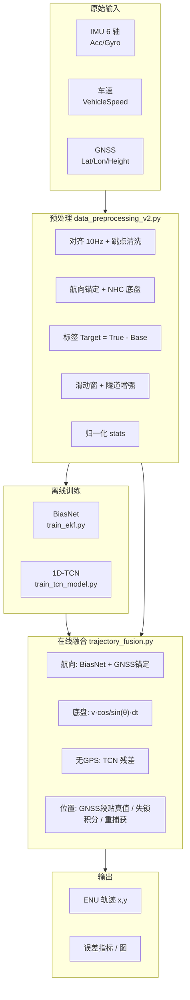
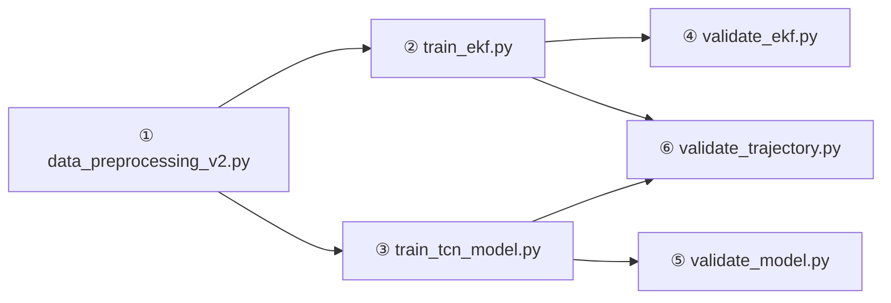

# GPS 失联定位 — 输入、输出与处理架构

> 当前工程默认：**Data01 训练/测试，Data02 验证**；融合推理入口为 `trajectory_fusion.py` + `validate_trajectory.py`。  
> 采样率：**10 Hz**（`dt = 0.1 s`）；时序窗口：**30 帧（3 s）**。

---

## 1. 系统总览



**核心思想**：用 **航位推算底盘（Base）** 做粗轨迹，用 **TCN 预测每步残差** 修正；**BiasNet** 在失锁时辅助航向；**有 GNSS 时位置直接跟测量**。

---

## 2. 原始数据输入

### 2.1 标定实车（当前主流程）

路径：`标定实车数据/`，每个数据集三个 Tab 分隔文件：

| 文件 | 主要字段 | 物理量 |
|------|----------|--------|
| `Data0x_IMU.txt` | `Time_s`, `AccX_g`…`GyroZ_degs` | 加速度 (g)、角速度 (°/s) |
| `Data0x_VehicleSpeed.txt` | `Time_s`, `VehicleSpeed_kmh` | 车速 (km/h) |
| `Data0x_GNSS.txt` | `Time_s`, `Latitude_deg`, `Longitude_deg`, `Height_m`, `GPS_Heading`… | WGS84、航向等 |

### 2.2 数据划分（`dataset_split.json`）

| 角色 | 数据集 | 时间范围（约） |
|------|--------|----------------|
| 训练 | Data01 前 80% | 0 – 251 s |
| 测试 | Data01 后 20% | 251 – 314 s |
| 验证 | Data02 整段 | 0 – 291 s |

260316 路跑 CSV 默认 **不参与**（`USE_260316 = False`）。

### 2.3 融合推理时的序列输入（`seq` dict）

由 `trajectory_data.load_calibration_segment()` 或路测 `load_segment()` 生成：

| 键名 | 形状 | 含义 |
|------|------|------|
| `Time_s` | (T,) | 时间戳 |
| `imu_raw` | (T, 6) | 原始 IMU，顺序同训练 |
| `gyro_z_rad` | (T,) | 陀螺 Z (rad/s) |
| `v_ms` | (T,) | 车速 (m/s) |
| `gps_theta` | (T,) | ENU 航向 (rad) |
| `gps_valid` | (T,) bool | 该帧是否认为 GNSS 有效 |
| `enu_x_truth`, `enu_y_truth` | (T,) | GNSS 转 ENU 真值（评估用） |

---

## 3. 预处理流水线（训练数据制造）

脚本：`data_preprocessing_v2.py`

### 3.1 处理步骤

```
原始三文件 (不等间隔)
    → 时间对齐到 10 Hz 网格
    → GNSS 跳点清洗 (隐含速度 > 150 km/h 则插值修复)
    → WGS84 → 本地 ENU
    → GPS 航向（位移梯度 + HeadingRaw，低速/静止过滤）
    → 航向序列：GPS 有效帧锚定 + 陀螺积分
    → NHC 底盘：Base_dx = v·cos(θ)·dt,  Base_dy = v·sin(θ)·dt
    → 真值步长：True_dx/dy = diff(ENU)
    → 标签：Target_dx/dy = True - Base  （TCN 要学的残差）
    → 标签 ±4σ 截断
    → 仅当连续 30 帧 GPS_valid 全为真才生成训练窗
    → 可选：模拟隧道段重算 Base/Target（隧道增强）
    → 按 Data01 训练段统计 mean/std，逐列归一化
```

### 3.2 中间量（aligned_data / val_aligned）

| 列名 | 含义 |
|------|------|
| `Heading_rad` | 融合航向 |
| `Base_dx`, `Base_dy` | 航位推算单步位移 (m) |
| `True_dx`, `True_dy` | GNSS 单步真值位移 |
| `Target_dx`, `Target_dy` | 残差标签 |
| `ENU_x`, `ENU_y` | 平面位置真值 |
| `GPS_valid` | 0/1 有效标志 |

### 3.3 训练用张量（模型直接吃的 I/O）

**TCN（`train_tcn_model.py`）**

| | 规格 |
|---|------|
| **输入** `X` | `(N, 30, 9)` float32 |
| **输出** `Y` | `(N, 2)` — `[Target_dx, Target_dy]` (m) |

**9 维特征（每帧，归一化后）：**

| 序号 | 特征名 | 来源 |
|------|--------|------|
| 0–5 | `AccX_g` … `GyroZ_degs` | IMU |
| 6 | `VehicleSpeed_ms` | 车速 m/s |
| 7 | `Base_dx` | 当前底盘东向步长 |
| 8 | `Base_dy` | 当前底盘北向步长 |

**BiasNet（`train_ekf.py`）**

| | 规格 |
|---|------|
| **输入** | `(N, 30, 6)` — 仅归一化 IMU 六通道 |
| **输出** | `(N, 1)` — 陀螺 Z 零偏 (rad/s) |

标签：`b_inst = gyro_z_rad - dθ_GPS/dt` → `median_filter(size=31)` → 无效段线性插值 → 再 `median_filter(size=63)`。

| 超参（`train_ekf.py`） | 值 |
|------------------------|-----|
| 训练数据 | **仅 Data01** 全段（与预处理时间切分无关，BiasNet 用整段 Data01 滑窗） |
| 验证数据 | **Data02** 全段；无 Data02 则 Data01 随机 15% |
| `WINDOW_SIZE` / `TARGET_DT` | 30 / 0.1 s |
| `BIAS_SMOOTH_W` | 31 帧（≈3.1 s） |
| `BATCH_SIZE` | 256 |
| `EPOCHS` | 80 |
| `LR` | 3e-4 |
| `PATIENCE` | 15（早停） |
| LR 衰减 | `ReduceLROnPlateau` patience=8, factor=0.5 |
| 损失 / 指标 | `huber` + `mae` |
| 归一化 | 读取 `preprocessed_data/normalization_stats.json` 中 IMU 6 通道 stats |
| 权重 | `trained_models/biasnet_weights.weights.h5` |
| 元信息 | `trained_models/biasnet_info.json` |
| 随机种子 | `np/tf` seed=42 |

**注意**：必须先跑 `data_preprocessing_v2.py` 生成 `normalization_stats.json`，再跑 `train_ekf.py`。

### 3.4 预处理产出文件

```
preprocessed_data/
├── X_train.npy, Y_train.npy      # Data01 训练
├── X_test.npy,  Y_test.npy       # Data01 测试
├── X_val.npy,   Y_val.npy        # Data02 验证
├── timestamps.npy, ts_test.npy, ts_val.npy
├── normalization_stats.json    # 各特征 mean/std
├── dataset_split.json
├── aligned_data.csv              # Data01 对齐表
└── val_aligned.csv               # Data02 对齐表
```

### 3.5 预处理配置参数（`data_preprocessing_v2.py` 全文）

修改训练数据分布时，**优先改本脚本顶部常量**，改完需重新跑预处理再训练。

#### 路径与数据源

| 常量 | 默认值 | 说明 |
|------|--------|------|
| `DATA_DIR_CALIB` | `标定实车数据/` | 标定三文件根目录 |
| `DATA_CSV_REAL` | `260316_Data/260316_Data.csv` | 路跑 CSV（仅 `USE_260316=True` 时用） |
| `OUTPUT_DIR` | `preprocessed_data/` | 全部 `.npy` / `stats` 输出目录 |
| `CALIB_TRAIN_ID` | `"Data01"` | 训练 + 同集测试 |
| `CALIB_VAL_ID` | `"Data02"` | 验证（held-out，不进 TCN 训练窗） |
| `DATA01_TEST_RATIO` | `0.2` | Data01 **按时间** 末 20% → `X_test` |
| `USE_260316` | `False` | 是否合并 260316（当前关闭） |
| `TRAIN_SPLIT_T` | `490.0` | 260316 训练截止（仅旧逻辑） |
| `REAL_TEST_T_START` | `620.0` | 260316 测试起点（仅旧逻辑） |

#### 时间网格与窗口

| 常量 | 默认值 | 说明 |
|------|--------|------|
| `TARGET_FREQ` | `10` Hz | 对齐目标采样率 |
| `TARGET_DT` | `0.1` s | `1/TARGET_FREQ` |
| `WINDOW_SIZE` | `30` | 滑动窗长度（3 s） |
| `WINDOW_STRIDE` | `1` | 窗步长（每帧滑动） |

#### GNSS / 车速 / 航向

| 常量 | 默认值 | 说明 |
|------|--------|------|
| `VEH_SPD_RAW_FACTOR` | `260.63` | 路跑原始轮速换算（标定 txt 已是 km/h，本项主要给 260316） |
| `GPS_MAX_SPEED_KMH` | `150.0` | 相邻 GPS 隐含速度超阈 → 判跳点并线性插值修复 |
| `MIN_SPEED_MS` | `0.5` | 低于此速度不用 GPS 航向锚定、不算 GPS 航向有效 |
| GPS 航向平滑 | `median_filter(..., size=9)` | 对 `arctan2(ΔENU)` 平滑 |
| GPS 航向有效 | `gps_ok & v>0.5 & 单步位移>0.05m` | 写入 `GPS_heading_valid`，用于锚定 |
| GPS 有效掩码 | `gps_ok`（清洗后非 NaN） | 写入 `GPS_valid`；**训练窗要求连续 30 帧全为 1** |
| 坐标 | WGS84 → ENU | 参考点：该段**第一个有效 GPS** 的 lat/lon/alt |
| 航向融合 | `compute_heading_with_gps_anchor` | GPS 有效且 `v>MIN_SPEED_MS` → 用 GPS 航向；否则陀螺积分 |
| NHC 底盘 | `dead_reckoning_nhc` | `Base_dx=v·cos(θ)·dt`，`Base_dy=v·sin(θ)·dt`，`dt` 来自时间差，首帧用 `TARGET_DT` |

#### 标签与清洗

| 项 | 值 | 说明 |
|----|-----|------|
| 残差定义 | `Target = True_diff(ENU) - Base` | 单位：米/步 |
| 标签截断 | `clean_label_outliers(sigma=4.0)` | 对 `Target_dx/dy` 做 ±4σ clip |
| 归一化统计 | **仅 `df01_train`** | `compute_norm_stats([df01_train])`，Data02 用同一套 mean/std |
| 归一化列 | `FEATURE_COLS` 共 9 列 | 见下表 |

`FEATURE_COLS`（与推理 `FEAT_KEYS` 一致）：

`AccX_g`, `AccY_g`, `AccZ_g`, `GyroX_degs`, `GyroY_degs`, `GyroZ_degs`, `VehicleSpeed_ms`, `Base_dx`, `Base_dy`

#### 隧道数据增强（仅 Data01 训练段）

| 常量 | 默认值 | 说明 |
|------|--------|------|
| `TUNNEL_AUG_DURATION_S` | `50.0` | 每段模拟失锁时长 |
| `TUNNEL_AUG_STRIDE` | `15` 帧 | 增强窗起点步进 |
| `TUNNEL_AUG_MAX_PER_DF` | `200` | 每段最多额外窗数 |
| 失锁起点 | `i + 5` | 相对扫描索引 |
| 失锁内逻辑 | `_recompute_base_for_outage` | 与推理一致：关 GPS → 重算航向+Base → `Target=True-Base` |

验证/测试窗：**不做**隧道增强（`tunnel_aug=False`）。

#### 地球椭球（ENU 转换）

| 常量 | 值 |
|------|-----|
| `EARTH_A` | 6378137.0 m |
| `EARTH_E2` | 0.00669437999014132 |

---

## 4. 模型结构 I/O

### 4.1 BiasNet + 航向推理（`ekf_navigator.py`）

```
输入 per step:
  imu_raw (T,6)  → 归一化 → 滑动窗 (30,6) → BiasNet → b̂_ω
  gyro_z, gps_theta, gps_valid, dt

航向逻辑（推理，非完整 EKF 迭代）:
  if gps_valid:  θ = gps_theta
  else:         θ += (gyro_z - b̂_ω) * dt

输出:
  ekf_h (T,)      航向 rad
  ekf_x/y (T,)    cumsum(v·cos/sin(θ)·dt)  （相对起点）
  net_bias (T,)   预测零偏
```

### 4.2 TCN 残差网络（`train_tcn_model.py` / `best_model.keras`）

```
输入:  (batch, 30, 9)
结构: Conv1D(64) → 6×残差块 dilation=[1,2,4,8,16,32] filters=64
      → 取最后时间步 → Dense(128→64→32) → Dense(2)
输出:  (batch, 2)  预测 [Δdx, Δdy] 残差 (m)，与 Y_train 同物理单位（未反归一化训练）

损失: 自定义 Huber(δ=0.1)
优化: Adam(lr=0.001)
验证: 优先 X_val/Y_val（Data02）；无则 X_train 随机 20% 划分
```

| 超参（`train_tcn_model.py`） | 值 |
|------------------------------|-----|
| `BATCH_SIZE` | 16 |
| `EPOCHS` | 150（常因早停提前结束） |
| `RANDOM_SEED` | 42 |
| `INITIAL_LR` | 0.001 |
| `HUBER_DELTA` | 0.1 m |
| `ES_PATIENCE` | 15（`EarlyStopping`，monitor=`val_loss`） |
| `LR_PATIENCE` | 5（`ReduceLROnPlateau`，factor=0.5，`min_lr=1e-6`） |
| 最佳权重 | `trained_models/best_model.keras` |
| 训练曲线 | `trained_models/training_history.png` |
| 指标 JSON | `trained_models/training_info.json` |

### 4.3 融合层（`FusedTrajectoryPredictor.predict`）

**输入**

- 同上 `seq` + 可选 `gps_valid_nav`（测试时可人为关 GPS 模拟隧道）
- 权重：`biasnet_weights.weights.h5`、`best_model.keras`、`normalization_stats.json`

**内部数据流**

```
1) BiasNet 全序列零偏
2) 航向 ekf_h：GPS 锚定 + 失锁陀螺积分
3) base_dx/dy = v * cos/sin(ekf_h) * dt
4) 若 无 GPS：
      取过去 30 帧构造 (30,9) → TCN → 残差 clip±2m
      pred_dx = base_dx + res_dx
   若 有 GPS：
      pred_dx = base_dx（不加 TCN）
5) 位置积分:
   - pure: cumsum(pred_dx/dy)，首点对齐 GNSS
   - fused (默认): 有 GPS 帧位置=GNSS；无 GPS 帧由上一点+步长；恢复 GPS 时重捕获
```

**输出 dict**

| 键 | 含义 |
|----|------|
| `fused_x`, `fused_y` | **最终融合轨迹**（ENU m） |
| `pure_x`, `pure_y` | 全程积分、无分段贴 GNSS（评估用） |
| `ekf_x`, `ekf_y`, `ekf_h` | 仅航向+底盘积分 |
| `dr_x`, `dr_y` | 纯陀螺、无 BiasNet |
| `base_dx`, `base_dy` | 逐步底盘位移 |

---

## 5. 测试与验证架构

### 5.1 三种测试层次

| 层次 | 脚本 | 测什么 | 输入 | 输出 |
|------|------|--------|------|------|
| TCN 单步 | `validate_model.py` | 残差回归精度 | `X_val` / `Y_val` | MAE/RMSE、散点图 |
| 航向/DR | `validate_ekf.py` | 航向与 DR 位置 | Data02 `seq` + 模拟失锁 | `ekf_validation.png` |
| **融合轨迹** | `validate_trajectory.py` | 端到端轨迹 | Data02 + 失锁 60s | `fused_trajectory.png`、Plotly |

### 5.2 融合测试协议（`validate_trajectory.py`）

```
1. 加载 Data02 → seq
2. gps_nav = gps_valid，但在 [15s, 75s) 强制 False（60s 隧道）
3. predict(use_gnss_position=True)  → 融合 + 重捕获
4. predict(use_gnss_position=False) → 纯积分（真实预测能力）
5. 与 enu_x_truth 对齐首点，算 RPE / 结束误差 / 中位误差
6. 保存 PNG；可选 --plotly 交互图
```

**关键指标**

- **隧道 RPE（60 s）**：失锁段位移增量误差；**纯积分**反映模型本身
- **锚定后 RPE**：含出隧道 GNSS 重捕获，仅作工程展示
- **全程 GPS 有效帧中位误差**：有信号时贴 GNSS，中位≈0 属正常

### 5.3 日常推理入口

```powershell
python validate_trajectory.py              # 标准融合验证
python validate_trajectory.py --plotly     # Plotly 交互
python run_fusion.py --dataset Data02 --loss-start 15 --loss-duration 60
```

---

## 6. 端到端 I/O 一览表

| 阶段 | 输入 | 输出 |
|------|------|------|
| 采集 | IMU、轮速、GNSS 原始文件 | — |
| 预处理 | 原始 txt | `X_*`, `Y_*`, `stats`, `*_aligned.csv` |
| BiasNet 训练 | `(N,30,6)` | `biasnet_weights.weights.h5` |
| TCN 训练 | `(N,30,9)` | `best_model.keras` |
| 融合推理 | `seq` + 权重 + `gps_valid_nav` | `fused_x/y` 轨迹 |
| 评估 | 轨迹 + `enu_*_truth` | 米制误差、PNG/Plotly |

---

## 7. 架构图（推理单帧，无 GPS）

```
                    ┌─────────────────┐
   imu (6) ────────►│    BiasNet      │──► b̂_ω
                    └────────┬────────┘
                             │
   gyro_z, gps_valid ───────►│ 航向 θ          │
                             ▼
                    ┌─────────────────┐
   v_ms ───────────►│ Base_dx/dy      │──► 底盘步长
                    │ v·cos(θ)·dt     │
                    └────────┬────────┘
                             │
   imu,v,base (30帧) ────────►│ TCN             │──► +Δdx,Δdy (clip±2m)
                    └────────┬────────┘
                             ▼
                    ┌─────────────────┐
                    │ cumsum → ENU    │──► fused_x, fused_y
                    └─────────────────┘
```

有 GPS 时：θ←GNSS，位置←GNSS 坐标；TCN 分支关闭。

---

## 8. 相关脚本索引

| 脚本 | 作用 |
|------|------|
| `data_preprocessing_v2.py` | 原始 → 训练张量 |
| `train_ekf.py` | 训练 BiasNet |
| `train_tcn_model.py` | 训练 TCN |
| `trajectory_fusion.py` | 融合推理核心 |
| `trajectory_data.py` | 加载 Data01/02、260316 |
| `validate_trajectory.py` | 融合测试 + 出图 |
| `validate_model.py` | TCN 单步测试 |
| `validate_ekf.py` | 航向/DR 测试 |
| `run_fusion.py` | 融合推理 CLI |

---

## 9. 训练与验证运行指南

### 9.1 环境

在项目根目录 `GPS/` 下执行（PowerShell 或 cmd 均可）：

```powershell
cd C:\Users\nxj\Desktop\GPS

# 建议 Python 3.10+，已安装 TensorFlow、numpy、pandas、scipy、matplotlib
pip install tensorflow numpy pandas scipy matplotlib

# 融合交互图（可选）
pip install plotly
```

**原始数据检查**（缺一则预处理失败）：

```
标定实车数据/
  Data01_IMU.txt  Data01_VehicleSpeed.txt  Data01_GNSS.txt
  Data02_IMU.txt  Data02_VehicleSpeed.txt  Data02_GNSS.txt
```

### 9.2 标准流水线（顺序不可乱）



| 步骤 | 命令 | 主要产出 | 耗时量级 |
|------|------|----------|----------|
| ① 预处理 | `python data_preprocessing_v2.py` | `preprocessed_data/*.npy`, `normalization_stats.json`, `dataset_split.json` | 数十秒 |
| ② BiasNet | `python train_ekf.py` | `biasnet_weights.weights.h5`, `biasnet_info.json` | 数分钟（GPU 更快） |
| ③ TCN | `python train_tcn_model.py` | `best_model.keras`, `training_info.json`, `training_history.png` | 数–十几分钟 |
| ④ EKF/航向 | `python validate_ekf.py` | `trained_models/ekf_validation.png` 等 | 约 1 分钟 |
| ⑤ TCN 单步 | `python validate_model.py` | 残差 MAE/RMSE、散点与轨迹图 | 约 1 分钟 |
| ⑥ 融合轨迹 | `python validate_trajectory.py` | `fused_trajectory.png` | 约 1 分钟 |
| ⑥' 交互图 | `python validate_trajectory.py --plotly` | 浏览器打开 Plotly | 同上 |

**改预处理参数后**：必须重跑 ①，再重跑 ②③（权重与 stats 绑定）。

### 9.3 各步说明与成功标志

#### ① 预处理

```powershell
python data_preprocessing_v2.py
```

控制台应出现类似：

- `X_train (Data01 训练): (N, 30, 9)` — 含隧道增强时 N 大于纯 GPS 窗
- `X_test (Data01 测试): (M, 30, 9)`
- `X_val (Data02 验证): (K, 30, 9)`
- `预处理完成！`

核对文件：

- `preprocessed_data/dataset_split.json` — 时间切分记录
- `preprocessed_data/normalization_stats.json` — `window_size: 30`, `target_freq: 10`

#### ② BiasNet 训练

```powershell
python train_ekf.py
```

依赖：`normalization_stats.json`（来自 ①）。

成功：`权重已保存到：trained_models/biasnet_weights.weights.h5`，并打印验证集 MAE（deg/s）。

#### ③ TCN 训练

```powershell
python train_tcn_model.py
```

依赖：`X_train.npy`, `Y_train.npy`, `X_val.npy`, `Y_val.npy`（来自 ①）。

成功：`best_model.keras` 更新，`training_info.json` 中 `best_val_loss` 为本次最优。

训练数据逻辑：

- **训练**：`X_train` / `Y_train`（Data01 训练时间 + 隧道增强窗）
- **验证**：`X_val` / `Y_val`（Data02，**不参与梯度**）
- **不用**：`X_test`（留给 `validate_model.py` 或自行评估）

#### ④–⑥ 验证（可选但建议全跑）

```powershell
python validate_ekf.py
python validate_model.py
python validate_trajectory.py
python validate_trajectory.py --plotly
```

`validate_trajectory.py` 默认：

| 参数 | 值 |
|------|-----|
| 数据段 | Data02（`trajectory_data.VAL_DATASET_ID`） |
| 模拟失锁 | 段首 **15 s** 起，持续 **60 s** |
| 权重 | `biasnet_weights.weights.h5` + `best_model.keras` + `normalization_stats.json` |
| 融合残差限幅 | `RESIDUAL_CLIP = 2.0` m（`trajectory_fusion.py`） |

### 9.4 日常推理（训练完成后）

```powershell
# Data02 全段，真实 GPS 掩码
python run_fusion.py --dataset Data02

# 与 validate_trajectory 相同的 15s 起 60s 隧道
python run_fusion.py --dataset Data02 --loss-start 15 --loss-duration 60

# 纯预测、不重捕获 GNSS
python run_fusion.py --dataset Data02 --loss-start 15 --loss-duration 60 --no-relock

# 导出 CSV
python run_fusion.py --dataset Data02 --csv outputs/fusion_Data02.csv
```

### 9.5 仅重训某一模型

| 场景 | 操作 |
|------|------|
| 只改 TCN 结构/超参 | ① 若未改特征 → 可跳过；③ `train_tcn_model.py` → ⑤⑥ |
| 只改 BiasNet | ① 若未改 IMU 归一化 → 可跳过；② `train_ekf.py` → ④⑥ |
| 改预处理切分/隧道/GPS 阈值 | **必须** ① → ② → ③ → 全部验证 |

### 9.6 可选脚本（非主流程）

| 命令 | 用途 |
|------|------|
| `python quantize_to_int8.py` | TCN 转 INT8（部署） |
| `python predict_full_trajectory.py` | 260316 全文件融合（需对应权重与数据） |

---

## 10. 版本说明

- 本文档描述 **Data01/Data02 标定方案**；若开启 `USE_260316`，训练/验证切分改为按 260316 时间戳，需同步改 `trajectory_data.VAL_T_START` 等配置。
- `PROJECT_SUMMARY.md` 中部分 260316 / 双数据源描述为历史版本，**以本文、`dataset_split.json` 及各脚本顶部常量为准**。
- BiasNet 训练使用 **Data01 全时长**滑窗；TCN 训练使用 **Data01 前 80% 时间**滑窗 + 隧道增强；二者划分策略不同，属设计如此。
